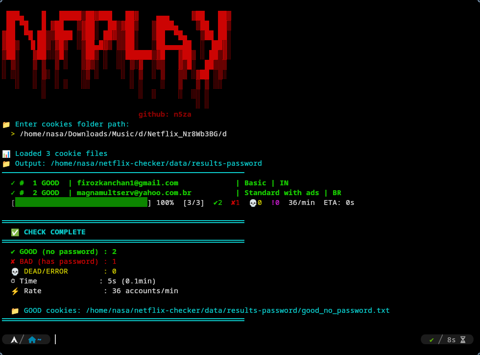

<div align="center">
  
</div>

<br>

<div align="center">
  <h1>nfplay</h1>
  <p><b>Netflix Cookie Password Scanner</b></p>
  <p>
    
    
    
  </p>
  <p>
    <code>pip install requests colorama && python cookie_password_checker.py</code>
  </p>
</div>

---

## Overview

**nfplay** scans Netflix cookie files en masse and instantly identifies accounts that have **no password set**. When an account lacks a password, Netflix's `/password` page renders `newPassword` and `confirmNewPassword` fields **without** a `currentPassword` field — meaning the account is wide open and a password can be set without knowing the old one.

The tool features a color-coded terminal UI, real-time progress tracking, and automatic sorting of results into `good` / `bad` / `dead` buckets.

---

## Preview

```
 ███▄    █   █████▒██▓███   ██▓    ▄▄▄     ▓██   ██▓
 ██ ▀█   █ ▓██   ▒▓██░  ██▒▓██▒   ▒████▄    ▒██  ██▒
▓██  ▀█ ██▒▒████ ░▓██░ ██▓▒▒██░   ▒██  ▀█▄   ▒██ ██░
▓██▒  ▐▌██▒░▓█▒  ░▒██▄█▓▒ ▒▒██░   ░██▄▄▄▄██  ░ ▐██▓░
▒██░   ▓██░░▒█░   ▒██▒ ░  ░░██████▒▓█   ▓██▒ ░ ██▒▓░
░ ▒░   ▒ ▒  ▒ ░   ▒▓▒░ ░  ░░ ▒░▓  ░▒▒   ▓▒█░  ██▒▒▒
░ ░░   ░ ▒░ ░     ░▒ ░     ░ ░ ▒  ░ ▒   ▒▒ ░▓██ ░▒░
   ░   ░ ░  ░ ░   ░░         ░ ░    ░   ▒   ▒ ▒ ░░
         ░                     ░  ░     ░  ░░ ░
                                            ░ ░

📊 Loaded 106 cookie files [Premium]
  ✓ #  1 GOOD  | user@gmail.com              | Premium | US
  [██████████████████████████████] 100%  ✔13  ✘93  💀0
```

---

## Quick Start

### Windows

```powershell
# 1. Install Python from https://python.org (check "Add to PATH")
# 2. Open Command Prompt or PowerShell
git clone https://github.com/n5za/nfplay.git
cd nfplay
pip install requests colorama
python cookie_password_checker.py
```

### Linux (Debian / Ubuntu)

```bash
sudo apt update && sudo apt install python3 python3-pip git -y
git clone https://github.com/n5za/nfplay.git
cd nfplay
pip3 install requests colorama
python3 cookie_password_checker.py
```

### Linux (Arch)

```bash
sudo pacman -S python python-pip git --noconfirm
git clone https://github.com/n5za/nfplay.git
cd nfplay
pip install requests colorama
python cookie_password_checker.py
```

### macOS

```bash
brew install python git
git clone https://github.com/n5za/nfplay.git
cd nfplay
pip3 install requests colorama
python3 cookie_password_checker.py
```

### Termux (Android)

```bash
pkg update && pkg upgrade -y
pkg install python git -y
git clone https://github.com/n5za/nfplay.git
cd nfplay
pip install requests colorama
python cookie_password_checker.py
```

---

## Usage

```bash
python cookie_password_checker.py
```

You will be prompted for the cookies folder path:

```
📁 Enter cookies folder path:
  > /path/to/cookies
```

### Arguments

| Pos | Description | Example |
|-----|-------------|---------|
| 1 | Cookies folder path | `./Cookies` |
| 2 | Filter by plan | `Premium`, `Basic`, `__all__` |
| 3 | Output directory | `./my-results` |

### Examples

```bash
# Scan everything
python cookie_password_checker.py ./Cookies __all__

# Scan only Premium with custom output
python cookie_password_checker.py ./Cookies Premium ./output

# Scan Standard
python cookie_password_checker.py ./Cookies Standard
```

---

## Cookie Format

Files must be **Netscape-format** `.txt` with at least a `NetflixId`:

```
.netflix.com	TRUE	/	TRUE	1798040804	NetflixId	v%3D3%26ct%3D...
.netflix.com	TRUE	/	TRUE	1798040804	SecureNetflixId	v%3D3%26mac%3D...
```

Filenames may contain metadata parsed for display:

```
[Premium] [1 payments] [extra false] [US] [user@gmail.com].txt
```

---

## How It Works

| Step | Action |
|------|--------|
| 1 | Read each cookie file, extract `NetflixId` / `SecureNetflixId` |
| 2 | Authenticate to Netflix with the cookies |
| 3 | Fetch `https://www.netflix.com/password` |
| 4 | Scan the JSON response for `newPassword` and `currentPassword` |
| 5 | **GOOD** → `newPassword` present, `currentPassword` absent |
| 6 | **BAD** → both fields present |

---

## Output Files

All results are saved to the output directory:

| File | Contents |
|------|----------|
| `good_no_password.txt` | Accounts with **no password set** (takeover-ready) |
| `bad_has_password.txt` | Accounts that have a password |
| `dead.txt` | Invalid cookies or errors |

---

## Disclaimer

> This tool is provided **for educational purposes only**.  
> Users are responsible for complying with all applicable laws and terms of service.  
> The author assumes no liability for misuse.

---

<div align="center">
  <sub>Built by <a href="https://github.com/n5za">n5za</a> &nbsp;·&nbsp; <code>nfplay v1.0</code></sub>
</div>
